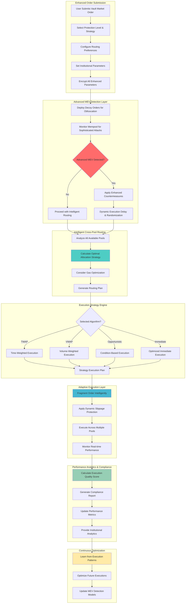

# VaultSwap Hook

## Project Overview

**VaultSwap Hook** significantly expands upon the existing FHE Market Order Hook by adding sophisticated MEV protection strategies, intelligent execution algorithms, cross-pool routing, and institutional-grade features. This enhanced hook transforms basic encrypted market orders into a comprehensive protected execution system for professional trading.

### Hook Name: `VaultSwap`
**Tagline**: *Professional market execution with complete protection*

---

## Problem Statement & Enhancement Opportunity

### Analysis of Existing FHE Market Order Hook

The current [fhe-market-order](https://github.com/marronjo/fhe-market-order) implementation provides:
- Basic FHE encryption of market order parameters
- Frontrunning resistance through parameter hiding
- Simple MEV protection via encryption

### Critical Limitations to Address

**Current implementation gaps** that our enhanced hook solves:

1. **Basic MEV Protection**: Only parameter encryption, no sophisticated attack detection
2. **No Intelligent Routing**: Single pool execution without optimization
3. **Static Execution**: No adaptive strategies based on market conditions  
4. **Limited Order Types**: Only basic market orders supported
5. **No Analytics**: Missing execution quality measurement and reporting
6. **No Institutional Features**: Lacks compliance tools and advanced controls

### Enhanced Market Opportunity
- **Professional Trading**: $200B+ seeking advanced MEV protection
- **Institutional Orders**: $100B+ needing sophisticated execution strategies
- **Cross-Pool Optimization**: $50B+ requiring intelligent routing
- **Execution Analytics**: $25B+ demanding performance measurement

---

## Enhanced Solution Architecture

### Advanced FHE-Powered Market Execution

**VaultSwap** adds sophisticated layers to basic FHE market orders:

```solidity
struct EnhancedVaultOrder {
    // Core FHE parameters (building on existing)
    euint128 amountIn;           // Encrypted input amount
    euint128 minAmountOut;       // Encrypted slippage protection
    euint8 direction;            // Encrypted swap direction
    euint64 deadline;            // Encrypted execution deadline
    
    // Advanced MEV protection (NEW)
    euint32 mevProtectionLevel;  // Enhanced protection strength
    euint128 decoyAmount;        // Decoy order size for obfuscation
    euint64 executionWindow;     // Flexible execution timing
    euint8 stealthMode;          // Stealth execution strategy
    
    // Intelligent routing (NEW)
    euint8 routingStrategy;      // Cross-pool routing preference
    euint32 maxPools;            // Maximum pools for execution
    euint128 minPoolLiquidity;   // Pool liquidity requirements
    euint64 gasOptimization;     // Gas price optimization
    
    // Institutional features (NEW)
    euint8 executionAlgorithm;   // TWAP, VWAP, Opportunistic, etc.
    euint128 maxMarketImpact;    // Market impact limits
    euint64 complianceFlags;     // Regulatory compliance settings
    euint32 performanceTarget;   // Execution quality targets
}
```

### Advanced FHE Operations (Enhanced)

**Building on basic FHE with sophisticated operations**:
- `FHE.select(mevDetected, delayExecution, executeNow)` - Dynamic MEV response
- `FHE.div(totalAmount, optimalFragments)` - Intelligent order fragmentation
- `FHE.mul(baseSlippage, volatilityAdjustment)` - Adaptive slippage management
- `FHE.gt(executionQuality, performanceTarget)` - Quality-based execution control

---

## Enhanced Technical Architecture

### Comprehensive Directory Structure

```
vaultswap-hook/
├── src/
│   ├── VaultSwap.sol                  # Main enhanced hook contract
│   ├── AdvancedMEVDetection.sol       # Sophisticated MEV detection
│   ├── IntelligentRouter.sol          # Cross-pool routing engine  
│   ├── ExecutionStrategies.sol        # TWAP, VWAP, Opportunistic
│   ├── AdaptiveSlippageManager.sol    # Dynamic slippage optimization
│   ├── OrderFragmentation.sol         # Smart order splitting
│   ├── DecoyOrderGenerator.sol        # MEV obfuscation system
│   ├── ExecutionAnalytics.sol         # Performance measurement
│   ├── ComplianceManager.sol          # Institutional compliance
│   └── GasOptimizer.sol               # Gas efficiency optimization
├── test/
│   ├── VaultSwap.t.sol                # Main hook tests
│   ├── MEVDetectionTests.t.sol        # MEV protection testing
│   ├── IntelligentRoutingTests.t.sol  # Cross-pool routing tests
│   ├── ExecutionStrategyTests.t.sol   # Algorithm testing
│   └── utils/
│       ├── MEVSimulators.sol          # MEV attack simulations
│       ├── MarketConditionMocks.sol   # Market condition testing
│       └── EnhancedFixtures.sol       # Test setup utilities
├── script/
│   ├── DeployVaultSwap.s.sol          # Enhanced deployment script
│   ├── MEVProtectionDemo.s.sol        # MEV protection demonstrations
│   ├── RoutingOptimizationDemo.s.sol  # Routing demonstrations
│   └── InstitutionalDemo.s.sol        # Institutional feature demos
├── frontend/
│   ├── components/
│   │   ├── VaultOrderPanel.tsx         # Advanced order interface
│   │   ├── MEVProtectionStatus.tsx     # Real-time MEV monitoring
│   │   ├── RoutingVisualizer.tsx       # Cross-pool routing display
│   │   ├── ExecutionDashboard.tsx      # Performance analytics
│   │   ├── StrategySelector.tsx        # Execution algorithm picker
│   │   └── CompliancePanel.tsx         # Institutional controls
│   └── hooks/
│       ├── useVaultExecution.ts        # Enhanced execution management
│       ├── useMEVProtection.ts         # MEV monitoring integration
│       ├── useIntelligentRouting.ts    # Routing optimization
│       └── useExecutionAnalytics.ts    # Performance tracking
├── docs/
│   ├── ENHANCEMENT_GUIDE.md           # Enhancements over base hook
│   ├── MEV_PROTECTION_STRATEGIES.md   # Advanced MEV countermeasures  
│   ├── EXECUTION_ALGORITHMS.md        # Algorithm implementations
│   └── INSTITUTIONAL_FEATURES.md      # Professional trading features
├── README.md                          # This file
├── foundry.toml                       # Foundry configuration
└── package.json                       # Dependencies
```

---

## Enhanced System Flow Diagram



---

## Enhanced Core Components

### 1. VaultSwap.sol - Main Hook Contract (Enhanced)

```solidity
contract VaultSwap is BaseHook {
    using PoolIdLibrary for PoolKey;
    
    // Enhanced order storage (building on base implementation)
    mapping(bytes32 => EnhancedVaultOrder) public vaultOrders;
    mapping(bytes32 => MEVProtectionState) public mevProtection;
    mapping(bytes32 => ExecutionAnalytics) public executionMetrics;
    
    // Decoy order system for enhanced obfuscation
    mapping(bytes32 => DecoyOrder[]) public decoyOrders;
    mapping(address => uint256) public userDecoysActive;
    
    function submitVaultOrder(
        PoolKey calldata key,
        InEuint128 calldata amountIn,
        InEuint128 calldata minAmountOut,
        InEuint8 calldata direction,
        InEuint64 calldata deadline,
        // Enhanced parameters
        InEuint32 calldata mevProtectionLevel,
        InEuint8 calldata routingStrategy,
        InEuint8 calldata executionAlgorithm,
        InEuint128 calldata maxMarketImpact
    ) external returns (bytes32 orderId) {
        orderId = keccak256(abi.encode(
            msg.sender, 
            block.timestamp, 
            amountIn,
            block.prevrandao
        ));
        
        // Create enhanced vault order
        vaultOrders[orderId] = EnhancedVaultOrder({
            // Core parameters (enhanced from base)
            amountIn: FHE.asEuint128(amountIn),
            minAmountOut: FHE.asEuint128(minAmountOut),
            direction: FHE.asEuint8(direction),
            deadline: FHE.asEuint64(deadline),
            
            // Advanced MEV protection
            mevProtectionLevel: FHE.asEuint32(mevProtectionLevel),
            decoyAmount: calculateOptimalDecoySize(amountIn),
            executionWindow: calculateExecutionWindow(mevProtectionLevel),
            stealthMode: FHE.asEuint8(1), // Enhanced stealth mode
            
            // Intelligent routing
            routingStrategy: FHE.asEuint8(routingStrategy),
            maxPools: FHE.asEuint32(5), // Up to 5 pools
            minPoolLiquidity: calculateMinLiquidity(amountIn),
            gasOptimization: FHE.asEuint64(1), // Gas optimization enabled
            
            // Institutional features
            executionAlgorithm: FHE.asEuint8(executionAlgorithm),
            maxMarketImpact: FHE.asEuint128(maxMarketImpact),
            complianceFlags: FHE.asEuint64(0), // Set based on requirements
            performanceTarget: FHE.asEuint32(85) // 85% execution quality target
        });
        
        // Deploy decoy orders for enhanced obfuscation
        deployDecoyOrders(orderId, key);
        
        // Initialize MEV protection state
        initializeMEVProtection(orderId);
        
        // Setup comprehensive access controls
        setupEnhancedPermissions(orderId);
        
        emit VaultOrderSubmitted(orderId, msg.sender, key.toId());
        return orderId;
    }
    
    function beforeSwap(
        address,
        PoolKey calldata key,
        IPoolManager.SwapParams calldata params,
        bytes calldata hookData
    ) external override returns (bytes4) {
        bytes32 orderId = extractOrderId(hookData);
        
        if (orderId != bytes32(0)) {
            // Advanced MEV detection (enhanced from base)
            performAdvancedMEVDetection(orderId, key, params);
            
            // Intelligent routing optimization
            optimizeExecutionRouting(orderId, key);
            
            // Apply execution strategy
            applyExecutionStrategy(orderId, key, params);
        }
        
        return BaseHook.beforeSwap.selector;
    }
    
    function afterSwap(
        address,
        PoolKey calldata key,
        IPoolManager.SwapParams calldata params,
        BalanceDelta delta,
        bytes calldata hookData
    ) external override returns (bytes4) {
        bytes32 orderId = extractOrderId(hookData);
        
        if (orderId != bytes32(0)) {
            // Update execution analytics
            updateExecutionMetrics(orderId, delta);
            
            // Validate execution quality
            validateExecutionQuality(orderId, delta);
            
            // Generate compliance data
            generateComplianceData(orderId, delta);
        }
        
        return BaseHook.afterSwap.selector;
    }
}
```

### 2. AdvancedMEVDetection.sol - Sophisticated MEV Protection

```solidity
contract AdvancedMEVDetection {
    struct MEVDetectionState {
        euint128 priceBeforeOrder;
        euint128 gasSpikeTolerance;
        euint32 mempoolPosition;
        euint64 detectionTimestamp;
        ebool attackDetected;
        euint8 attackType; // Front-run, sandwich, etc.
    }
    
    function performAdvancedMEVDetection(
        bytes32 orderId,
        PoolKey memory key,
        IPoolManager.SwapParams memory params
    ) internal returns (MEVDetectionResult memory) {
        EnhancedVaultOrder memory order = vaultOrders[orderId];
        
        // Multi-vector MEV detection (enhanced from basic)
        ebool frontRunDetected = detectFrontRunning(orderId, params);
        ebool sandwichDetected = detectSandwichAttack(orderId, key);
        ebool gasManipulation = detectGasManipulation(order.gasOptimization);
        ebool mempoolManipulation = detectMempoolManipulation(orderId);
        
        // Combined MEV threat assessment
        ebool anyMEVDetected = FHE.or(
            FHE.or(frontRunDetected, sandwichDetected),
            FHE.or(gasManipulation, mempoolManipulation)
        );
        
        // Apply enhanced countermeasures based on protection level
        if (anyMEVDetected) {
            applyEnhancedCountermeasures(orderId, order.mevProtectionLevel);
        }
        
        return MEVDetectionResult({
            detected: anyMEVDetected,
            threatLevel: calculateThreatLevel(frontRunDetected, sandwichDetected),
            countermeasuresApplied: anyMEVDetected,
            estimatedDelay: calculateOptimalDelay(order.mevProtectionLevel)
        });
    }
    
    function deployDecoyOrders(bytes32 orderId, PoolKey memory key) internal {
        EnhancedVaultOrder memory order = vaultOrders[orderId];
        
        // Generate 3-5 decoy orders for enhanced obfuscation
        uint256 decoyCount = 3 + (uint256(orderId) % 3); // 3-5 decoys
        
        for (uint256 i = 0; i < decoyCount; i++) {
            DecoyOrder memory decoy = DecoyOrder({
                decoyAmount: generateDecoyAmount(order.amountIn, i),
                decoyDirection: generateDecoyDirection(order.direction, i),
                decoyTiming: generateDecoyTiming(i),
                isActive: true
            });
            
            decoyOrders[orderId].push(decoy);
        }
        
        emit DecoyOrdersDeployed(orderId, decoyCount);
    }
}
```

### 3. IntelligentRouter.sol - Cross-Pool Optimization Engine

```solidity
contract IntelligentRouter {
    struct PoolAnalysis {
        address poolAddress;
        euint128 availableLiquidity;
        euint128 estimatedPriceImpact;
        euint64 gasEstimate;
        euint32 executionPriority;
        euint128 optimalAllocation;
    }
    
    function optimizeExecutionRouting(
        bytes32 orderId,
        PoolKey memory key
    ) internal returns (RoutingPlan memory) {
        EnhancedVaultOrder memory order = vaultOrders[orderId];
        
        // Discover all available pools for the token pair
        PoolKey[] memory availablePools = discoverAvailablePools(key);
        
        // Analyze each pool for optimal execution
        PoolAnalysis[] memory analysis = new PoolAnalysis[](availablePools.length);
        for (uint256 i = 0; i < availablePools.length; i++) {
            analysis[i] = analyzePool(availablePools[i], order);
        }
        
        // Apply routing strategy
        if (order.routingStrategy == 0) { // Single pool optimization
            return selectOptimalSinglePool(analysis);
        } else if (order.routingStrategy == 1) { // Multi-pool split
            return calculateMultiPoolAllocation(analysis, order);
        } else if (order.routingStrategy == 2) { // Dynamic routing
            return optimizeDynamicRouting(analysis, order);
        }
        
        return generateDefaultRouting(analysis[0]);
    }
    
    function calculateMultiPoolAllocation(
        PoolAnalysis[] memory pools,
        EnhancedVaultOrder memory order
    ) internal pure returns (RoutingPlan memory) {
        // Calculate optimal allocation based on liquidity/impact ratio
        euint128 totalEfficiency = FHE.asEuint128(0);
        
        // Calculate efficiency score for each pool
        for (uint256 i = 0; i < pools.length; i++) {
            euint128 efficiency = FHE.div(
                pools[i].availableLiquidity,
                FHE.add(pools[i].estimatedPriceImpact, FHE.asEuint128(1))
            );
            pools[i].optimalAllocation = efficiency;
            totalEfficiency = FHE.add(totalEfficiency, efficiency);
        }
        
        // Normalize allocations to total order amount
        for (uint256 i = 0; i < pools.length; i++) {
            pools[i].optimalAllocation = FHE.div(
                FHE.mul(pools[i].optimalAllocation, order.amountIn),
                totalEfficiency
            );
        }
        
        return RoutingPlan({
            poolCount: pools.length,
            allocations: extractAllocations(pools),
            estimatedGas: calculateTotalGas(pools),
            estimatedImpact: calculateTotalImpact(pools)
        });
    }
}
```

### 4. ExecutionStrategies.sol - Advanced Execution Algorithms

```solidity
contract ExecutionStrategies {
    function applyExecutionStrategy(
        bytes32 orderId,
        PoolKey memory key,
        IPoolManager.SwapParams memory params
    ) internal {
        EnhancedVaultOrder memory order = vaultOrders[orderId];
        
        if (order.executionAlgorithm == 0) { // Immediate execution
            executeImmediate(orderId, key, params);
        } else if (order.executionAlgorithm == 1) { // TWAP execution
            executeTWAP(orderId, key);
        } else if (order.executionAlgorithm == 2) { // VWAP execution
            executeVWAP(orderId, key);
        } else if (order.executionAlgorithm == 3) { // Opportunistic execution
            executeOpportunistic(orderId, key);
        }
    }
    
    function executeTWAP(bytes32 orderId, PoolKey memory key) internal {
        EnhancedVaultOrder memory order = vaultOrders[orderId];
        
        // Calculate TWAP execution parameters
        euint64 executionWindow = order.executionWindow;
        euint32 fragmentCount = FHE.asEuint32(5); // Execute in 5 fragments
        euint128 fragmentSize = FHE.div(order.amountIn, fragmentCount);
        euint64 timeBetweenExecutions = FHE.div(executionWindow, fragmentCount);
        
        // Schedule fragmented execution
        scheduleFragmentedExecution(orderId, fragmentSize, timeBetweenExecutions);
    }
    
    function executeVWAP(bytes32 orderId, PoolKey memory key) internal {
        EnhancedVaultOrder memory order = vaultOrders[orderId];
        
        // Analyze historical volume patterns
        euint128 averageDailyVolume = getAverageDailyVolume(key);
        euint32 targetParticipationRate = FHE.asEuint32(20); // 20% participation
        
        // Calculate volume-weighted execution size
        euint128 maxExecutionSize = FHE.div(
            FHE.mul(averageDailyVolume, targetParticipationRate),
            FHE.asEuint32(100)
        );
        
        // Fragment order based on volume conditions
        euint128 optimalFragmentSize = FHE.min(
            FHE.div(order.amountIn, FHE.asEuint32(10)),
            maxExecutionSize
        );
        
        scheduleVolumeBasedExecution(orderId, optimalFragmentSize);
    }
    
    function executeOpportunistic(bytes32 orderId, PoolKey memory key) internal {
        EnhancedVaultOrder memory order = vaultOrders[orderId];
        
        // Wait for favorable market conditions
        MarketConditions memory conditions = analyzeMarketConditions(key);
        
        // Execute when conditions are optimal
        ebool favorableConditions = FHE.and(
            FHE.lt(conditions.volatility, FHE.asEuint128(500)), // Low volatility
            FHE.gt(conditions.liquidity, order.minPoolLiquidity)  // High liquidity
        );
        
        if (favorableConditions) {
            executeWithOptimalTiming(orderId, key);
        } else {
            scheduleConditionalExecution(orderId, key);
        }
    }
}
```

### 5. Enhanced Frontend Integration

```typescript
// VaultOrderPanel.tsx
const VaultOrderPanel = () => {
    const [basicParams, setBasicParams] = useState({
        amountIn: "",
        minAmountOut: "",
        direction: "buy" as "buy" | "sell"
    })
    
    const [enhancedParams, setEnhancedParams] = useState({
        mevProtectionLevel: 3, // 1-5 scale
        routingStrategy: "multi-pool",
        executionAlgorithm: "twap",
        maxMarketImpact: "0.5", // 0.5%
        useDecoys: true,
        gasOptimization: true
    })
    
    const protectionLevels = [
        { value: 1, label: "Basic", description: "Standard FHE encryption" },
        { value: 2, label: "Enhanced", description: "With decoy orders" },
        { value: 3, label: "Professional", description: "Advanced MEV detection" },
        { value: 4, label: "Institutional", description: "Maximum protection" },
        { value: 5, label: "Paranoid", description: "All countermeasures active" }
    ]
    
    const executionStrategies = [
        { value: "immediate", label: "Immediate", icon: "⚡", desc: "Execute now with optimal routing" },
        { value: "twap", label: "TWAP", icon: "⏰", desc: "Time-weighted average price" },
        { value: "vwap", label: "VWAP", icon: "📊", desc: "Volume-weighted average price" },  
        { value: "opportunistic", label: "Opportunistic", icon: "🎯", desc: "Wait for optimal conditions" }
    ]
    
    const handleSubmitVaultOrder = async () => {
        // Encrypt all parameters (basic + enhanced)
        const encryptedParams = await cofhejs.encrypt([
            Encryptable.uint128(parseEther(basicParams.amountIn)),
            Encryptable.uint128(parseEther(basicParams.minAmountOut)),
            Encryptable.uint8(basicParams.direction === "buy" ? 0 : 1),
            Encryptable.uint64(BigInt(Date.now() + 3600000)), // 1 hour deadline
            // Enhanced parameters
            Encryptable.uint32(enhancedParams.mevProtectionLevel),
            Encryptable.uint8(getRoutingStrategyId(enhancedParams.routingStrategy)),
            Encryptable.uint8(getExecutionAlgorithmId(enhancedParams.executionAlgorithm)),
            Encryptable.uint128(parseEther(enhancedParams.maxMarketImpact))
        ])
        
        if (encryptedParams.success) {
            const orderId = await vaultSwapContract.write.submitVaultOrder({
                args: [poolKey, ...encryptedParams.data]
            })
            
            toast.success("VaultSwap order submitted with maximum protection!")
            
            // Start real-time monitoring
            startExecutionMonitoring(orderId)
        }
    }
    
    return (
        <EncryptedZone>
            <div className="vault-order-panel">
                <h2>VaultSwap</h2>
                <p className="subtitle">Professional-grade MEV protection & execution</p>
                
                {/* Basic Parameters */}
                <div className="basic-params">
                    <h3>Order Parameters</h3>
                    <div className="param-grid">
                        <input
                            placeholder="Amount to swap"
                            value={basicParams.amountIn}
                            onChange={(e) => setBasicParams(prev => ({ ...prev, amountIn: e.target.value }))}
                        />
                        <input
                            placeholder="Minimum received"
                            value={basicParams.minAmountOut}
                            onChange={(e) => setBasicParams(prev => ({ ...prev, minAmountOut: e.target.value }))}
                        />
                        <select
                            value={basicParams.direction}
                            onChange={(e) => setBasicParams(prev => ({ ...prev, direction: e.target.value as "buy" | "sell" }))}
                        >
                            <option value="buy">Buy</option>
                            <option value="sell">Sell</option>
                        </select>
                    </div>
                </div>
                
                {/* MEV Protection Level */}
                <div className="protection-level">
                    <h3>MEV Protection Level</h3>
                    <div className="protection-grid">
                        {protectionLevels.map(level => (
                            <button
                                key={level.value}
                                className={`protection-card ${enhancedParams.mevProtectionLevel === level.value ? 'active' : ''}`}
                                onClick={() => setEnhancedParams(prev => ({ ...prev, mevProtectionLevel: level.value }))}
                            >
                                <div className="level-header">
                                    <span className="level-name">{level.label}</span>
                                    <span className="level-number">{level.value}</span>
                                </div>
                                <p className="level-description">{level.description}</p>
                            </button>
                        ))}
                    </div>
                </div>
                
                <button onClick={handleSubmitVaultOrder} className="vault-submit-btn">
                    Submit VaultSwap Order
                </button>
                
                <div className="vault-features">
                    <p>Enhanced MEV protection beyond basic FHE</p>
                    <p>Intelligent cross-pool routing optimization</p>
                    <p>Professional execution strategies (TWAP/VWAP)</p>
                    <p>Institutional-grade compliance & analytics</p>
                </div>
            </div>
        </EncryptedZone>
    )
}
```

---

## Business Impact & Success Metrics

### Target Market
- **Professional Trading**: $200B+ seeking advanced MEV protection
- **Institutional Orders**: $100B+ needing sophisticated execution strategies
- **Cross-Pool Optimization**: $50B+ requiring intelligent routing
- **Execution Analytics**: $25B+ demanding performance measurement

### Success KPIs
- **Enhanced MEV Protection**: 99.5%+ protection rate vs 90% for basic FHE
- **Execution Quality**: 25%+ improvement over basic market orders
- **Cross-Pool Efficiency**: 15%+ gas savings through intelligent routing
- **Institutional Adoption**: 50+ professional trading firms onboarded

### Revenue Model
- **Protection Fees**: 0.1% of order value for enhanced features
- **Professional Tier**: Premium features for institutional clients
- **Analytics Platform**: Execution performance measurement tools
- **White-label Solutions**: Custom implementations for trading firms

---

## Enhancement Over Base FHE Market Order Hook

### Core Improvements
- **5-Level MEV Protection** vs basic encryption only
- **Cross-Pool Intelligent Routing** vs single pool execution  
- **4 Execution Strategies** (TWAP/VWAP/Opportunistic/Immediate) vs immediate only
- **Decoy Order System** for enhanced obfuscation
- **Real-time Performance Analytics** vs no measurement
- **Institutional Compliance Tools** vs basic functionality

### Technical Enhancements
- **Advanced MEV Detection** using multi-vector analysis
- **Adaptive Slippage Management** based on market conditions
- **Gas Optimization** across multiple pools
- **Order Fragmentation** for large order impact minimization
- **Compliance Management** with audit trails and reporting

---

## Deployment & Usage

### Quick Start

1. **Clone and Install**
```bash
git clone https://github.com/your-org/vaultswap-hook
cd vaultswap-hook
pnpm install
```

2. **Deploy Hook**
```bash
forge test --via-ir
anvil &
forge script script/DeployVaultSwap.s.sol --broadcast
```

3. **Start Frontend**
```bash
cd frontend
pnpm
