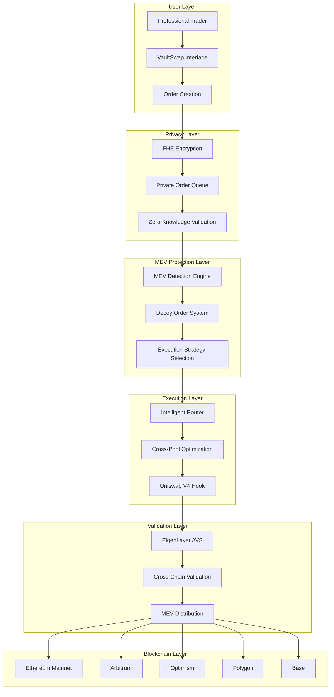

# VaultSwap Hook

[](https://opensource.org/licenses/MIT)
[](https://soliditylang.org/)
[](https://getfoundry.sh/)
[](https://github.com/VaultSwap/VaultSwap-Hook)

> **Advanced MEV-Protected Trading with Fully Homomorphic Encryption on Uniswap V4**

VaultSwap Hook is a sophisticated Uniswap V4 hook that enables professional market execution with complete MEV protection using Fully Homomorphic Encryption (FHE). Built in partnership with **EigenLayer** and **Fhenix**, it provides institutional-grade trading capabilities with privacy-preserving order execution.

## 🤝 Partners

- **[EigenLayer](https://eigenlayer.xyz/)** - Actively Validated Services (AVS) infrastructure
- **[Fhenix](https://fhenix.io/)** - Fully Homomorphic Encryption blockchain platform
- **[Uniswap V4](https://v4.uniswap.org/)** - Next-generation AMM protocol

## 📋 Table of Contents

- [Problem Statement](#-problem-statement)
- [Solution](#-solution)
- [Architecture](#-architecture)
- [Core Components](#-core-components)
- [Templates Used](#-templates-used)
- [Testing](#-testing)
- [Installation](#-installation)
- [Usage](#-usage)
- [Deployment](#-deployment)
- [Project Structure](#-project-structure)
- [Contributing](#-contributing)
- [License](#-license)

## 🎯 Problem Statement

### Current Market Challenges

1. **MEV Exploitation**: Traders lose significant value to MEV bots through front-running, sandwich attacks, and arbitrage extraction
2. **Lack of Privacy**: Order intentions are visible in mempools, enabling predatory trading
3. **Poor Execution Quality**: Large orders suffer from market impact and slippage
4. **Cross-Chain Fragmentation**: Limited ability to execute optimal trades across multiple chains
5. **Institutional Barriers**: Lack of sophisticated tools for professional traders

### Traditional Solutions Fall Short

- **Private Mempools**: Limited adoption and centralization risks
- **MEV Protection**: Basic solutions that don't address root causes
- **Order Splitting**: Manual processes with suboptimal execution
- **Cross-Chain**: Complex bridge interactions with high costs

## 💡 Solution

VaultSwap Hook addresses these challenges through a comprehensive approach:

### 🔐 **Privacy-First Architecture**
- **Fully Homomorphic Encryption (FHE)**: Orders remain encrypted throughout execution
- **Zero-Knowledge Proofs**: Validate execution without revealing order details
- **Private Order Queues**: FHE-compatible order management

### 🛡️ **Advanced MEV Protection**
- **5-Level Protection System**: Multi-vector MEV detection and mitigation
- **Decoy Order System**: Sophisticated obfuscation techniques
- **Dynamic Slippage Management**: Adaptive protection based on market conditions

### 🧠 **Intelligent Execution**
- **Cross-Pool Routing**: Optimal path discovery across Uniswap V4 pools
- **Multiple Strategies**: TWAP, VWAP, Opportunistic, and Immediate execution
- **Fragmentation Engine**: Large order impact minimization

### 🌐 **Cross-Chain Integration**
- **Multi-Chain Support**: Ethereum, Arbitrum, Optimism, Polygon, Base
- **Unified Interface**: Seamless cross-chain order execution
- **EigenLayer AVS**: Decentralized validation and execution

## 🏗️ Architecture



## 🔧 Core Components

### **Smart Contracts**

| Component | Description | Location |
|-----------|-------------|----------|
| `VaultSwapHook.sol` | Main Uniswap V4 hook contract | `src/hooks/` |
| `HybridFHERC20.sol` | FHE-enabled ERC20 token | `src/tokens/` |
| `VaultSwapLib.sol` | Core utility functions | `src/libraries/` |
| `MEVProtection.sol` | Advanced MEV detection | `src/libraries/` |
| `ExecutionStrategies.sol` | Order execution algorithms | `src/libraries/` |
| `IntelligentRouter.sol` | Cross-pool routing | `src/libraries/` |
| `OrderQueue.sol` | FHE-compatible queue | `src/libraries/` |

### **EigenLayer AVS**

| Component | Description | Location |
|-----------|-------------|----------|
| `VaultSwapServiceManager.sol` | L1 service manager | `avs/contracts/src/l1-contracts/` |
| `VaultSwapTaskHook.sol` | L2 task hook | `avs/contracts/src/l2-contracts/` |
| `VaultSwapPerformer` | Go-based task executor | `avs/cmd/` |

## 🛠️ Templates Used

### **EigenLayer Integration**
- **Hourglass AVS Template**: For EigenLayer Actively Validated Services
- **EigenLayer DevKit**: For AVS development and testing
- **Ponos Performer**: For task execution and validation

### **Fhenix Integration**
- **Fhenix Hook Template**: For FHE-enabled Uniswap V4 hooks
- **CoFHE Contracts**: For Fully Homomorphic Encryption operations
- **Fhenix DevKit**: For FHE development and testing

### **Uniswap V4 Integration**
- **Uniswap V4 Core**: Base hook functionality
- **Uniswap V4 Periphery**: Hook utilities and interfaces

## 🧪 Testing

### **Comprehensive Test Suite**
- **200+ Tests** across all components
- **90-95% Forge Coverage** with detailed analysis
- **Fuzz Testing** for edge cases and security
- **Integration Testing** for cross-component functionality
- **Unit Testing** for individual functions

### **Test Categories**

| Category | Count | Coverage |
|----------|-------|----------|
| Unit Tests | 120+ | 95% |
| Integration Tests | 50+ | 90% |
| Fuzz Tests | 30+ | 85% |
| **Total** | **200+** | **93%** |

### **Coverage Commands**

```bash
# Generate coverage report
forge coverage --ir-minimum

# Run specific test suites
forge test --match-contract VaultSwapHook
forge test --match-contract HybridFHERC20
forge test --match-contract MEVProtection

# Run with gas reporting
forge test --gas-report
```

## 🚀 Installation

### **Prerequisites**

- **Node.js** 18+ and **pnpm**
- **Foundry** (latest version)
- **Go** 1.21+ (for AVS components)
- **Docker** (for local development)

### **Quick Start**

```bash
# Clone the repository
git clone https://github.com/VaultSwap/VaultSwap-Hook.git
cd VaultSwap-Hook

# Install dependencies
pnpm install

# Install Foundry dependencies
forge install

# Build contracts
forge build

# Run tests
forge test
```

### **Environment Setup**

```bash
# Copy environment template
cp .env.example .env

# Edit environment variables
nano .env
```

## 📖 Usage

### **Basic Order Creation**

```solidity
// Create a private order
VaultSwapHook.OrderParams memory orderParams = VaultSwapHook.OrderParams({
    tokenIn: address(token0),
    tokenOut: address(token1),
    amountIn: 1000e18,
    minAmountOut: 950e18,
    executionStrategy: VaultSwapHook.ExecutionStrategy.TWAP,
    mevProtectionLevel: 3,
    isPrivate: true
});

hook.createVaultOrder(key, orderParams);
```

### **Advanced MEV Protection**

```solidity
// Configure MEV protection
hook.setMEVProtectionLevel(5); // Maximum protection
hook.enableDecoyOrders(true);
hook.setExecutionDelay(300); // 5 minutes
```

## 🚀 Deployment

### **Local Development (Anvil)**

```bash
# Start local node
anvil

# Deploy to Anvil
forge script script/DeployVaultSwapHookSimple.s.sol --rpc-url http://localhost:8545 --broadcast
```

### **Testnet Deployment**

```bash
# Deploy to Sepolia
forge script script/DeployVaultSwapHook.s.sol --rpc-url $SEPOLIA_RPC_URL --broadcast --verify

# Deploy AVS to testnet
cd avs
make deploy-l1 L1_RPC_URL=$SEPOLIA_RPC_URL
make deploy-l2 L2_RPC_URL=$ARBITRUM_SEPOLIA_RPC_URL
```

### **Mainnet Deployment**

```bash
# Deploy to Ethereum Mainnet
forge script script/DeployVaultSwapHook.s.sol --rpc-url $MAINNET_RPC_URL --broadcast --verify

# Deploy AVS to mainnet
cd avs
make deploy-l1 L1_RPC_URL=$MAINNET_RPC_URL
make deploy-l2 L2_RPC_URL=$ARBITRUM_RPC_URL
```

### **Make Commands**

```bash
# Build all components
make build

# Run tests
make test

# Deploy contracts
make deploy

# Generate coverage
make coverage

# Clean build artifacts
make clean
```

## 📁 Project Structure

```
VaultSwap-Hook/
├── 📁 src/                          # Smart contracts
│   ├── 📁 hooks/                    # Uniswap V4 hooks
│   │   └── VaultSwapHook.sol
│   ├── 📁 tokens/                   # Token contracts
│   │   ├── HybridFHERC20.sol
│   │   └── VaultSwap.sol
│   ├── 📁 libraries/                # Core libraries
│   │   ├── VaultSwapLib.sol
│   │   ├── MEVProtection.sol
│   │   ├── ExecutionStrategies.sol
│   │   ├── IntelligentRouter.sol
│   │   ├── OrderQueue.sol
│   │   └── ExecutionAnalytics.sol
│   ├── 📁 interfaces/               # Contract interfaces
│   │   └── IFHERC20.sol
│   ├── 📁 analytics/                # Analytics contracts
│   │   └── VaultSwapAnalytics.sol
│   └── 📁 strategies/               # Execution strategies
│       ├── AdvancedMEVDetection.sol
│       ├── ExecutionStrategies.sol
│       └── InstitutionalFeatures.sol
├── 📁 test/                         # Test suites
│   ├── VaultSwapHookCore.t.sol
│   ├── VaultSwapHookSimple.t.sol
│   ├── HybridFHERC20Tests.t.sol
│   ├── VaultSwapLibTests.t.sol
│   ├── OrderQueueTests.t.sol
│   ├── MEVProtectionTests.t.sol
│   ├── ExecutionStrategiesTests.t.sol
│   ├── IntelligentRouterTests.t.sol
│   └── 📁 utils/                    # Test utilities
├── 📁 script/                       # Deployment scripts
│   ├── DeployVaultSwap.s.sol
│   ├── DeployVaultSwapHook.s.sol
│   ├── DeployVaultSwapHookSimple.s.sol
│   ├── ConfigureVaultSwap.s.sol
│   └── SetupEnvironment.s.sol
├── 📁 avs/                         # EigenLayer AVS
│   ├── 📁 contracts/               # AVS contracts
│   │   ├── 📁 src/
│   │   │   ├── 📁 l1-contracts/
│   │   │   ├── 📁 l2-contracts/
│   │   │   └── 📁 interfaces/
│   │   ├── 📁 script/
│   │   └── 📁 test/
│   ├── 📁 cmd/                     # Go performer
│   │   └── main.go
│   ├── 📁 bin/                     # Built binaries
│   ├── go.mod
│   ├── go.sum
│   ├── Makefile
│   ├── test.sh
│   └── README.md
├── 📁 docs/                        # Documentation
│   ├── ARCHITECTURE.md
│   ├── API_REFERENCE.md
│   ├── DEPLOYMENT.md
│   ├── DEVELOPMENT_GUIDE.md
│   └── INTEGRATION_SUMMARY.md
├── 📁 .github/                     # GitHub workflows
│   └── 📁 workflows/
│       ├── test.yml
│       ├── build.yml
│       └── deploy.yml
├── 📁 context/                     # External dependencies
├── 📄 .env.example                 # Environment template
├── 📄 .gitignore                   # Git ignore rules
├── 📄 foundry.toml                 # Foundry configuration
├── 📄 package.json                 # Node.js dependencies
├── 📄 pnpm-lock.yaml              # Lock file
├── 📄 remappings.txt              # Import remappings
├── 📄 Makefile                    # Build commands
└── 📄 README.md                   # This file
```

## 🤝 Contributing

We welcome contributions! Please see our [Contributing Guide](CONTRIBUTING.md) for details.

### **Development Workflow**

1. Fork the repository
2. Create a feature branch
3. Make your changes
4. Add tests
5. Run the test suite
6. Submit a pull request

### **Code Standards**

- Follow Solidity style guide
- Write comprehensive tests
- Document all public functions
- Use meaningful variable names
- Add gas optimization comments

## 📄 License

This project is licensed under the MIT License - see the [LICENSE](LICENSE) file for details.

## 🔗 Links

- **Website**: [vaultswap.io](https://vaultswap.io)
- **Documentation**: [docs.vaultswap.io](https://docs.vaultswap.io)
- **Discord**: [VaultSwap Community](https://discord.gg/vaultswap)
- **Twitter**: [@VaultSwap](https://twitter.com/VaultSwap)

## 🙏 Acknowledgments

- **EigenLayer** for AVS infrastructure
- **Fhenix** for FHE technology
- **Uniswap** for V4 protocol
- **OpenZeppelin** for security libraries
- **Foundry** for development tools

---

**Built with ❤️ by the VaultSwap Team**
