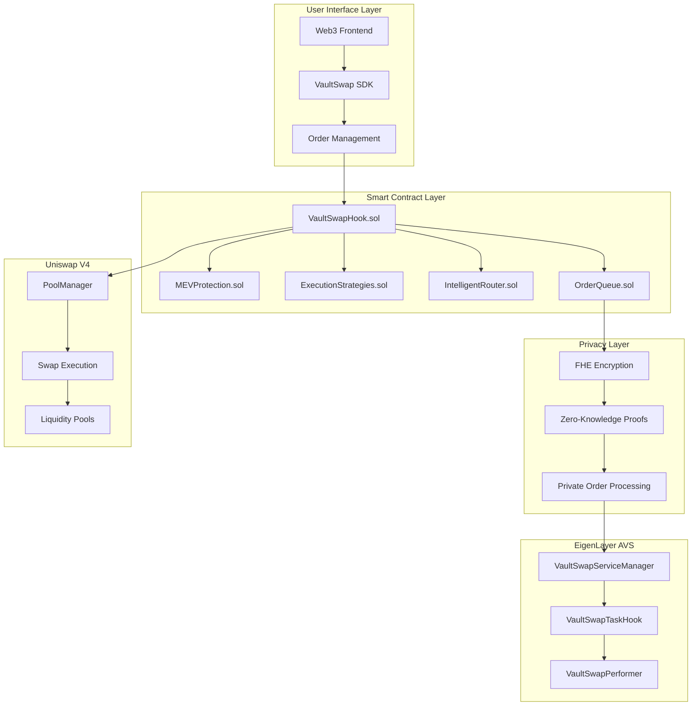

# VaultSwap Hook Architecture

## Overview

VaultSwap Hook is a sophisticated Uniswap V4 hook that provides advanced MEV protection, privacy-preserving order execution, and intelligent cross-pool routing. The architecture is designed to be modular, scalable, and secure.

## System Architecture

### High-Level Components



## Core Components

### 1. VaultSwapHook.sol

The main hook contract that integrates with Uniswap V4.

**Key Features:**
- Order creation and management
- MEV protection integration
- Cross-pool routing
- FHE order processing

**Key Functions:**
```solidity
function createVaultOrder(PoolKey calldata key, OrderParams calldata params) external
function executeOrder(bytes32 orderId) external
function cancelOrder(bytes32 orderId) external
function getOrderInfo(bytes32 orderId) external view returns (OrderInfo memory)
```

### 2. MEVProtection.sol

Advanced MEV detection and protection mechanisms.

**Protection Levels:**
1. **Basic**: Slippage protection
2. **Standard**: Front-running detection
3. **Advanced**: Sandwich attack prevention
4. **Professional**: Multi-vector analysis
5. **Institutional**: Decoy order system

**Key Functions:**
```solidity
function detectMEV(PoolKey memory key, SwapParams memory params) external view returns (bool)
function applyProtection(uint8 level, OrderParams memory params) external
function generateDecoyOrders(bytes32 orderId) external
```

### 3. ExecutionStrategies.sol

Multiple execution strategies for different market conditions.

**Strategies:**
- **TWAP**: Time-Weighted Average Price
- **VWAP**: Volume-Weighted Average Price
- **Opportunistic**: Market condition-based
- **Immediate**: Instant execution

**Key Functions:**
```solidity
function executeTWAP(OrderParams memory params) external
function executeVWAP(OrderParams memory params) external
function executeOpportunistic(OrderParams memory params) external
```

### 4. IntelligentRouter.sol

Cross-pool routing optimization.

**Features:**
- Path discovery
- Liquidity analysis
- Gas optimization
- Cross-chain routing

**Key Functions:**
```solidity
function findOptimalPath(address tokenIn, address tokenOut, uint256 amount) external view returns (Path memory)
function calculateRoute(Path memory path) external view returns (uint256 expectedOutput)
```

### 5. OrderQueue.sol

FHE-compatible order queue management.

**Features:**
- Encrypted order storage
- Priority-based execution
- Batch processing
- Queue management

**Key Functions:**
```solidity
function push(euint128 order) external
function pop() external returns (euint128)
function peek() external view returns (euint128)
function size() external view returns (uint256)
```

## Data Flow

### Order Creation Flow

1. **User Input**: Trader specifies order parameters
2. **FHE Encryption**: Order details are encrypted
3. **MEV Analysis**: System analyzes potential MEV risks
4. **Strategy Selection**: Optimal execution strategy is chosen
5. **Route Discovery**: Best path through pools is found
6. **Order Queuing**: Order is added to encrypted queue

### Order Execution Flow

1. **Queue Processing**: Orders are processed in priority order
2. **MEV Protection**: Protection mechanisms are applied
3. **Route Execution**: Orders are executed through optimal paths
4. **Settlement**: Tokens are transferred and fees are collected
5. **Analytics**: Execution data is recorded for analysis

## Security Considerations

### FHE Security
- All sensitive data remains encrypted
- Zero-knowledge proofs validate execution
- No private keys are exposed

### MEV Protection
- Multi-vector attack detection
- Decoy order obfuscation
- Dynamic slippage management

### Access Control
- Role-based permissions
- Multi-signature requirements
- Emergency pause functionality

## Scalability

### Horizontal Scaling
- Multiple hook instances
- Load balancing
- Sharded order processing

### Vertical Scaling
- Gas optimization
- Batch processing
- Efficient data structures

## Integration Points

### Uniswap V4
- Hook interface compliance
- Pool manager integration
- Swap execution coordination

### EigenLayer
- AVS task validation
- Operator coordination
- Cross-chain execution

### Fhenix
- FHE operations
- Encryption/decryption
- Privacy preservation

## Monitoring and Analytics

### On-Chain Metrics
- Order execution rates
- MEV protection effectiveness
- Gas usage optimization
- Cross-pool routing efficiency

### Off-Chain Metrics
- System performance
- User experience
- Security incidents
- Economic analysis

## Future Enhancements

### Planned Features
- Additional execution strategies
- Enhanced MEV protection
- Cross-chain bridge integration
- Institutional compliance tools

### Research Areas
- Advanced FHE applications
- Machine learning integration
- Quantum-resistant cryptography
- Decentralized governance