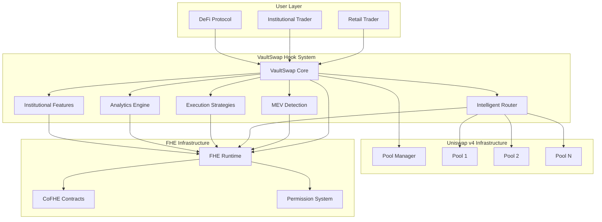
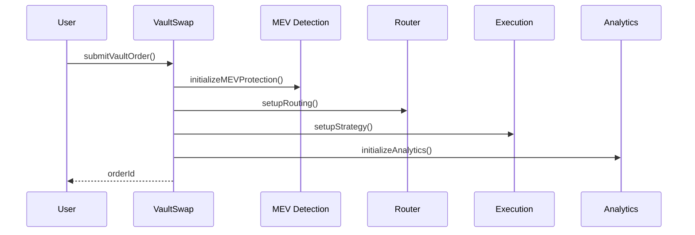
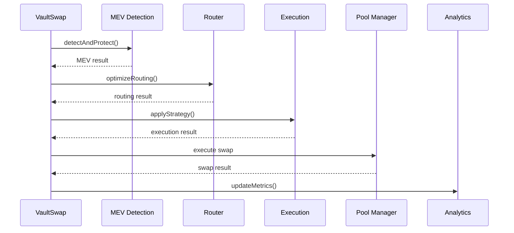

# VaultSwap Hook - Architecture Documentation

## Table of Contents
- [Overview](#overview)
- [System Architecture](#system-architecture)
- [Core Components](#core-components)
- [Data Flow](#data-flow)
- [Security Model](#security-model)
- [Performance Considerations](#performance-considerations)
- [Integration Points](#integration-points)

## Overview

VaultSwap Hook is a sophisticated Uniswap v4 hook that provides professional market execution with complete MEV protection. The system is built using Fully Homomorphic Encryption (FHE) to ensure privacy and security while maintaining high performance.

### Key Features
- **Advanced MEV Protection**: 5-level protection system with decoy orders and sophisticated attack detection
- **Intelligent Cross-Pool Routing**: Optimizes execution across multiple pools for best price and minimal impact
- **Execution Strategies**: TWAP, VWAP, and Opportunistic execution algorithms
- **Institutional Features**: Compliance tools, risk management, and reporting capabilities
- **Comprehensive Analytics**: Performance measurement and execution quality tracking

## System Architecture



## Core Components

### 1. VaultSwap Core Contract

The main hook contract that orchestrates all functionality.

**Key Responsibilities:**
- Order management and lifecycle
- Integration with Uniswap v4 hooks
- Coordination between components
- Access control and permissions

**Key Functions:**
```solidity
function submitVaultOrder(...) external returns (bytes32 orderId)
function _beforeSwap(...) internal override returns (...)
function _afterSwap(...) internal override returns (...)
```

### 2. Advanced MEV Detection

Sophisticated MEV protection system with multiple detection vectors.

**Detection Methods:**
- Front-running detection
- Sandwich attack detection
- Gas manipulation detection
- Mempool manipulation detection
- Price manipulation detection

**Protection Levels:**
- Level 1: Basic protection (2 decoys, 30s delay)
- Level 2: Enhanced protection (3 decoys, 60s delay)
- Level 3: Advanced protection (5 decoys, 120s delay)
- Level 4: Maximum protection (8 decoys, 300s delay)
- Level 5: Ultimate protection (12 decoys, 600s delay)

### 3. Intelligent Router

Cross-pool routing optimization engine.

**Routing Strategies:**
- Best Price: Optimize for lowest price impact
- Lowest Impact: Minimize market impact
- Fastest: Optimize for speed
- Balanced: Balance all factors

**Pool Analysis:**
- Liquidity analysis
- Gas cost optimization
- Price impact calculation
- Utilization tracking

### 4. Execution Strategies

Advanced execution algorithms for different trading scenarios.

**Strategy Types:**
- **Immediate**: Execute immediately
- **TWAP**: Time-Weighted Average Price execution
- **VWAP**: Volume-Weighted Average Price execution
- **Opportunistic**: Wait for optimal conditions

**Fragmentation:**
- Order splitting for large trades
- Time-based execution windows
- Volume-based execution targets

### 5. Analytics Engine

Comprehensive performance measurement and reporting.

**Metrics Tracked:**
- Execution quality (0-100)
- Slippage analysis
- Market impact measurement
- Gas efficiency
- MEV protection effectiveness

**Reporting:**
- Real-time analytics
- Historical performance
- Benchmark comparison
- Risk assessment

### 6. Institutional Features

Advanced features for institutional traders.

**Compliance Tools:**
- KYC/AML integration
- Regulatory compliance checking
- Risk limit enforcement
- Audit trail generation

**Risk Management:**
- Position size limits
- Daily volume limits
- Leverage restrictions
- Volatility controls

## Data Flow

### Order Submission Flow



### Order Execution Flow



## Security Model

### FHE Security

All sensitive data is encrypted using Fully Homomorphic Encryption:

```solidity
struct EnhancedVaultOrder {
    euint128 amountIn;           // Encrypted input amount
    euint128 minAmountOut;       // Encrypted slippage protection
    euint8 direction;            // Encrypted swap direction
    euint64 deadline;            // Encrypted execution deadline
    // ... more encrypted fields
}
```

### Access Control

Multi-layered access control system:

1. **Contract Level**: Only authorized contracts can call functions
2. **User Level**: Users can only access their own orders
3. **Institutional Level**: Additional compliance checks for institutions
4. **FHE Level**: Encrypted data requires proper permissions

### Permission System

FHE permissions are granted using the `FHE.allow()` pattern:

```solidity
// Grant contract permission
FHE.allowThis(encryptedValue);

// Grant user permission
FHE.allow(encryptedValue, userAddress);

// Grant global permission
FHE.allowGlobal(encryptedValue);
```

## Performance Considerations

### Gas Optimization

- **Batch Operations**: Process multiple orders in single transaction
- **Efficient Storage**: Optimized data structures for minimal gas usage
- **Caching**: Cache frequently accessed data
- **Lazy Loading**: Load data only when needed

### Execution Speed

- **Parallel Processing**: Execute multiple operations concurrently
- **Queue Management**: Efficient order queuing and processing
- **State Optimization**: Minimize state changes
- **Memory Management**: Efficient memory usage patterns

### Scalability

- **Horizontal Scaling**: Support for multiple pools
- **Vertical Scaling**: Handle large order sizes
- **Load Balancing**: Distribute load across components
- **Resource Management**: Efficient resource utilization

## Integration Points

### Uniswap v4 Integration

```solidity
function _beforeSwap(
    address,
    PoolKey calldata key,
    SwapParams calldata params,
    bytes calldata hookData
) internal override returns (bytes4, IPoolManager.BeforeSwapDelta, uint24) {
    // Process vault orders
    _processVaultOrders(key);
    
    // Apply MEV protection
    _applyMEVProtection(key, params);
    
    // Execute intelligent routing
    _executeIntelligentRouting(key, params);
    
    return (BaseHook.beforeSwap.selector, BeforeSwapDeltaLibrary.ZERO_DELTA, 0);
}
```

### FHE Integration

```solidity
// Create encrypted values
euint128 amount = FHE.asEuint128(1000);

// Perform encrypted operations
euint128 result = FHE.add(amount, FHE.asEuint128(100));

// Grant permissions
FHE.allowThis(result);
```

### External Service Integration

- **Price Feeds**: Oracle integration for price data
- **MEV Data**: External MEV detection services
- **Compliance**: KYC/AML service integration
- **Analytics**: External analytics platforms

## Deployment Architecture

### Network Support

- **Ethereum Mainnet**: Full feature set
- **Arbitrum One**: Optimized for L2
- **Base Mainnet**: Optimized for L2
- **Testnets**: Development and testing

### Configuration Management

- **Network-specific**: Different configs per network
- **Environment-based**: Different settings per environment
- **Dynamic Updates**: Runtime configuration updates
- **Validation**: Configuration validation and testing

## Monitoring and Observability

### Metrics Collection

- **Execution Metrics**: Order execution statistics
- **Performance Metrics**: System performance data
- **Security Metrics**: Security event tracking
- **Business Metrics**: Trading volume and revenue

### Alerting

- **MEV Detection**: Alert on MEV attacks
- **Risk Violations**: Alert on risk limit breaches
- **System Health**: Alert on system issues
- **Performance**: Alert on performance degradation

### Logging

- **Structured Logging**: JSON-formatted logs
- **Log Levels**: Debug, Info, Warn, Error
- **Log Aggregation**: Centralized log collection
- **Log Analysis**: Automated log analysis

## Future Enhancements

### Planned Features

- **Cross-Chain Support**: Multi-chain execution
- **Advanced Strategies**: More execution algorithms
- **AI Integration**: Machine learning for optimization
- **Mobile Support**: Mobile application integration

### Scalability Improvements

- **Layer 2 Optimization**: Better L2 integration
- **Batch Processing**: Improved batch operations
- **Caching Layer**: Advanced caching strategies
- **CDN Integration**: Content delivery optimization

## Conclusion

VaultSwap Hook represents a significant advancement in DeFi trading infrastructure, providing institutional-grade features with complete MEV protection. The architecture is designed for scalability, security, and performance while maintaining the privacy and decentralization principles of DeFi.

The system's modular design allows for easy extension and customization, making it suitable for a wide range of trading scenarios and institutional requirements.
